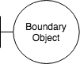
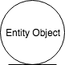
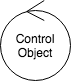
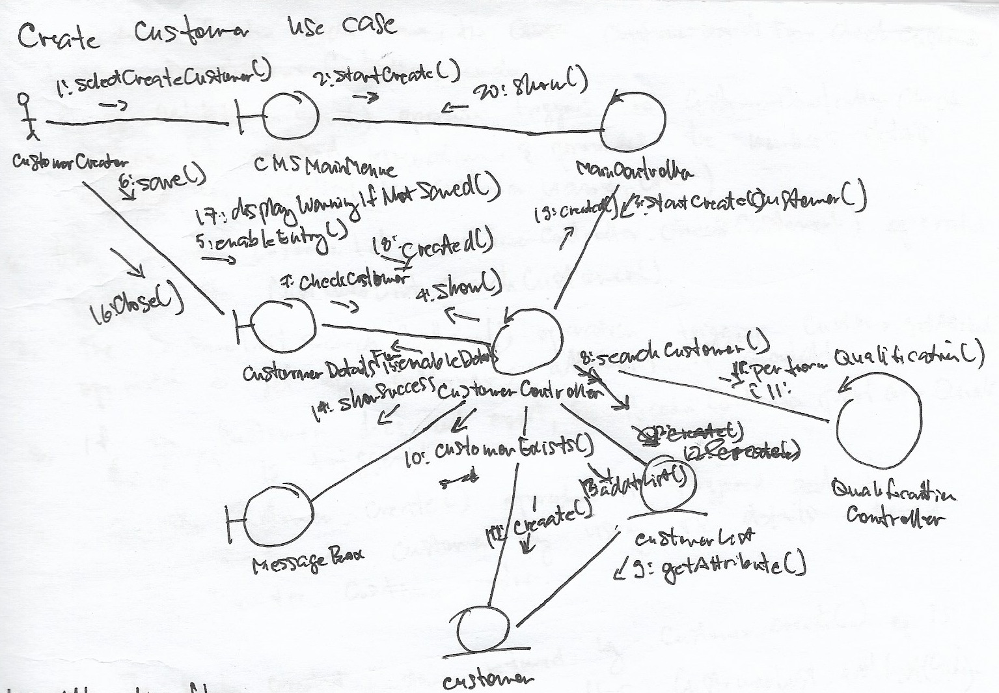

# Analysis Modeling

Analysis modeling in Software Engineering provides a high level technical and business presentation of the Software Requirements.

Analysis modeling has three dimensions:

- Information
- Behaviour
- Presentation

## Analysis Objects

### Boundary Objects (Presentation)

Objects that interact directly with Actors e.g. input data from a form.

*Figure 1. Boundary Object's symbol.*

### Entity Objects (Information)

Contains the information required that needs to be passed across the objects.

*Figure 2. Entity Object's symbol.*

### Control Objects (Behaviour)

Decides the behaviour of the system overall.

*Figure 3. Control Object's symbol.*

## Identifying Objects

### Identifying Boundary Objects

#### Types of Boundary Objects
- Interacts with a user.
- Interacts with another system.

#### Strategies
- Always start with the actors and identify the objects that they interact with directly. 
- Observe the flow of events of the use cases. From these events, you can identify the functionalities that are most likely covered by an interface.
- Sometimes it is specified in the System Interface Description or anywhere within the Requirements model.

##### Actors
Each actor will need an interface to interact with the system.

##### Flow of events
Flow of events in your Use Case Realization Report can help you identify your boundary objects.

### Identifying Entity Objects

Entity Objects are often found in the Domain Object Model.

#### Strategies
- Find out what information is needed.
- Look closely at the flow events and find any form of data or information that is being passed, updated and used across your system.

### Identifying Control Objects

Control Objects are usually the last objects to identify. Any behaviour that can't be classified as either Boundary or Entity will usually fall under Control Objects.

Control Objects can also behave as a glue that connects the other objects of the system together.

#### Typical behaviours
- Transaction-related
- Coordination-related
- Sequence-specific to one or more use cases

#### Strategies
- For every use case, there is usually one Control Object.
- Exceptions are when 
 - Control object appears in another use case.
 - Behaviour is complex that it needs more than one control object.
 - Explicitly specified by the use case.

## Defining Analysis Objects
 
 Think about the Classes that you need to instatiate the objects that you have defined. 
 These Classes will have the properties that it needs to satisfy the use cases.
 
At this point, a Class Diagram will be useful in defining your Analysis Object.
 
### Properties
 - Attributes
 - Behaviours
 - Relationships with other classes

## Case study: Bank Customer Management System

Let's look into a simple case study that covers the basic CRUD operations only.
This example will use the Analysis objects described above and as illustrated in Figures 1, 2 and 3 and will only cover the Create use case.

### Main use cases

- Create customer
- Search and display customer
- Perform qualification

### Create Customer

Refer to Figure 4 below for the Create Customer Collaboration Diagram.

*Figure 4. Create Customer Collaboration Diagram. Please excuse my handwriting.*

#### Flow of events
Flow of events for the Create Customer Use Case. This serves as supplementary information to the Collaboration Diagram above.

1. The use case starts when the Customer Creator selects the Create Customer option from the CMS Main Menu. `CMSMainMenu.selectCreateCustomer` is triggered.
2. The `CMSMainMenu.selectCreateCustomer` operation triggers `MainController.startCreateCustomer()` operation which delgates to `CustomerController.startCreateCustomer` operation.
3. The `CustomerController.startCreateCustomer` operation triggers the `CustomerDetailsForm.show()` to launch the Customer details form interface.
4. The Customer Creator enters the required details of the new customer into the text fields of `CustomerDetailsForm`.
5. When the Customer Creator clicks save, the `CustomerDetailsForm.save()` triggers the `CustomerController.checkCustomer()` operation and provides the member's details required for creation e.g. customer name, address, etc.
6. Using the customer Id, `CustomerController.checkCustomer()` operation triggers the `CustomerList.searchCustomer()`.
7. The `CustomerList.searchCustomer()` operation triggers `Customer.getAttribute()` operation the get the customer's stored information if available.
8. If the Customer does not exist, `QualificationController.performQualification()` is triggered.
9. The `Customer.create()` operation is then triggered to create the customer by using the details entered by the Customer Creator. 
10. The newly created `Customer` object retured by the `Customer.create()` operation is added to `CustomerList` after `CustomerList.addList()` is triggered.
11. The `MessageBox.showSuccess` operation is triggered to display a success message and Customer Creator is sent back to the `CustomerDetailsForm`.
12. The Customer Creator clicks the close button on the `CustomerDetailsForm`.
13. `CustomerDetailsForm.close()` operation triggers the `CustomerController.created()` operation.
14. `CustomerController.created()` operation triggers the `MainController.created()` operation.
15. `MainController.created()` operation triggers the `CMSMainMenu.show()` operation to bring the Customer Creator back to the `CMSMainMenu`.

 

