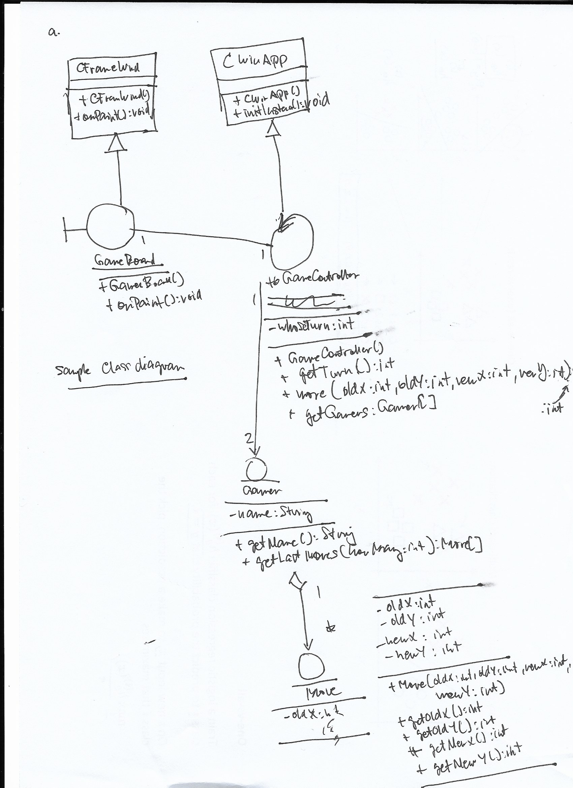

# Class Diagrams to Skeletal Classes

This technique is simple yet effective. I recommend doing this before you start your implementation.
This can help you figure out how you structure your classes and find out the possible flaws in your design before you start writing the code. 

## Draw the Class Diagram

In this example, we are inheriting an existing framework's operations.
It's best to use Analysis Objects to better represent what the classes are expected to do.
Writing down the operations or methods is optional. This will depend on the complexity of your system. Another option is to only include methods that are system critical. To know more about Analysis Objects, can refer to [this guide about Analysis Modeling](https://github.com/ardydedase/ardydedase.github.io/blob/master/content/software-engineering/analysis-modeling.md#analysis-modeling).



## Translate the Class Diagram to Skeletal Classes

This will be a good starting point for discussion with your team of how you structure your classes.
Most of the time, you will get ideas from other engineers. You will need to figure out what works best and find ways to manage the tradeoffs in your design. 

Skeletal classes include:

- Class declarations
- Class attributes
- Method signatures


### GameController

```java
public class GameController extends CWinApp {
	private GameBoard gameBoard = null;
	private Gamer[] gamers = new Gamer[2];
	//....
}

```

### GameBoard

```java
public class GameBoard extends CFrameWnd {
	private GameController gameController = null;
	//....
	
	public GameBoard (GameController gameController) {
		this.gameController = gameController;
	}
	//....	
}
```

### Gamer

```java 
import java.util.ArrayList;

public class Gamer {
	private ArrayList moves = new ArrayList();
	
	//....
	
	public void addMove(Move aMove) {
		moves.add(aMove);
	}
	
	//....
}

```

You'll notice that I skipped the `Move` class. This is because the operations that belong to that class are a little more obvious compared to the other classes. You can easily tell its association with the `Gamer` class in code snippet.