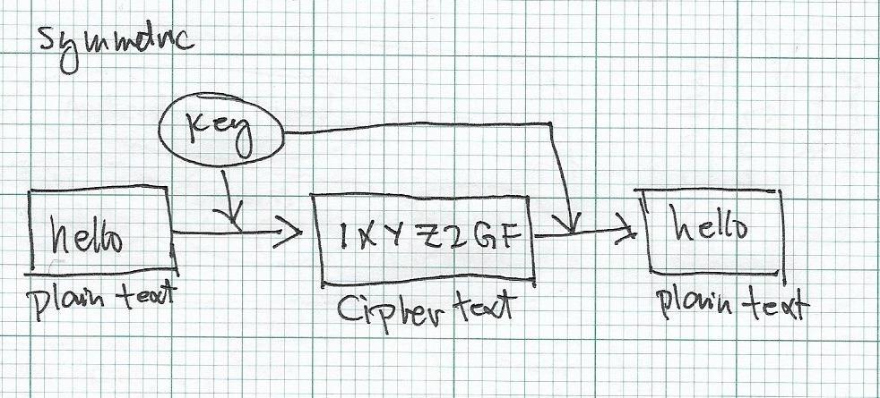
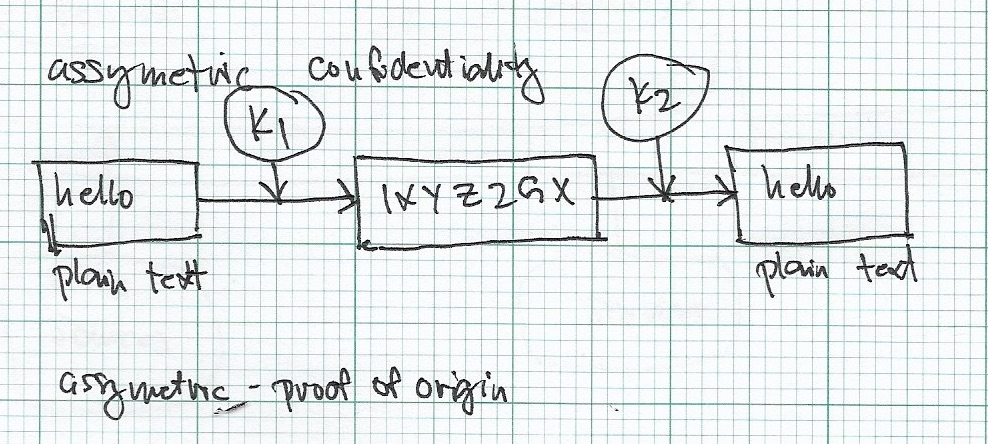

# Cryptography

The foundation of how our transactions over the internet are secured.

## Symmetric Cryptosystem

The analogy is simply a key opening a lock. It uses symmetric cipher algorithm.
This algorithm uses a symmetric key. This symmetric key can be shared across to be used to decrypt the ciphertext. Figure 1 below roughly illustrates how the symmetric cryptosystem works. The same key is used for encryption and decryption.

Figure 1. Symmetric Cryptosytem flow.

### Types of Symmetric Algorithms

#### Stream ciphers
Stream ciphers encrypt a single bit or byte of text at a time.

#### Block ciphers
Block ciphers takes a fixed number of bits and encrypt these bits once as a whole e.g. encrypts 64 bits or 128 bits.

### Disadvantages
- You rely on one key only.
- Practically it can be hard to share the same key across different parties.

## Assymetric Cryptosystem

The assymetric cyptosystem utilises what is called a "key pair". The key pair can be classified as public and private keys. Private key is kept secret and should not be shared, while the public key is published publicly to be used by anyone. Figure 2 below illustrates how assymmetric cryptosystem works where the keypair is `k1` and `k2`.

Figure 2. Symmetric Cryptosytem flow.

In Figure 2 above, `k1` and `k2` can be interchanged as public and private keys:

- Use case 1: `k1` is the public key and `k2` is the private key. 
	- Alice generates a key pair `k1` and `k2`.
	- Alice shares the public key `k1` to Bob.
	- Bob uses the public key `k1` to encrypt the message 'hello'.
	- Alice uses her private key `k2` to decrypt the message 'hello' from Bob.
- Use case 2: `k1` is the private key and `k2` is the public key.
	- Alice generates a key pair `k1` and `k2`.
	- Alice uses the private key `k1` to encrypt the message 'hello'.
	- Alice shares the public key `k2` to Bob. 
	- Bob uses the public key `k2` to decrypt Alice's message.

For Use case 2. The fact that the message can be decrypted by Bob using Alice's public key, Bob can be certain that the message exactly came from Alice and not from someone else.

